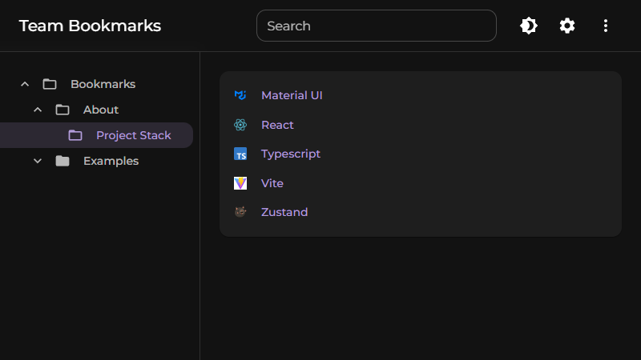

# 📚 Team Bookmarks

A lightweight, static bookmark organizer for developer teams.
Manage and share your essential links via a simple JSON file.

## 🖼️ Preview



## ✨ Core Features

- **Intuitive folder navigation**
- **Fast search across all bookmarks**
- **Export and store bookmarks in the browser**
- **Dark mode support**
- **Locally stored user settings**

## 🛠️ Technical Advantages

- **No database or backend required**
- **Statically hostable**
- **Collaborative via Git**
- **Easily customizable to fit your team’s needs**

## 🚀 Getting Started

1. Clone the repository:
   ```bash
   git clone https://github.com/goetmar/team-bookmarks.git
   ```
2. Install dependencies:
   ```bash
   npm install
   ```
3. Start the dev server:
   ```bash
   npm run dev
   ```

## ⚙️ How to Use

1. Go to `/src/data` and create a new `bookmarks.json` file:

   ```json
   {
     "$schema": "bookmarks.schema.json",
     "name": "Bookmarks",
     "bookmarks": []
   }
   ```

   This defines your root folder. You can name it freely and nest bookmarks or folders as needed.

2. Add your links and folders inside the `bookmarks` array. See `example.bookmarks.json` for a complete example.

3. Adjust the import in `src/hooks/useBookmarkStore.ts` to use the new file:

   ```ts
   import bookmarksJson from "../data/bookmarks.json";
   ```

4. Done! To update your bookmarks, simply edit the JSON file and redeploy.
